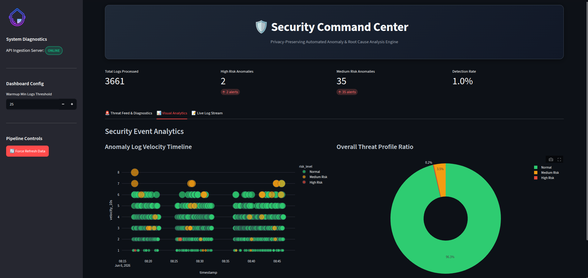
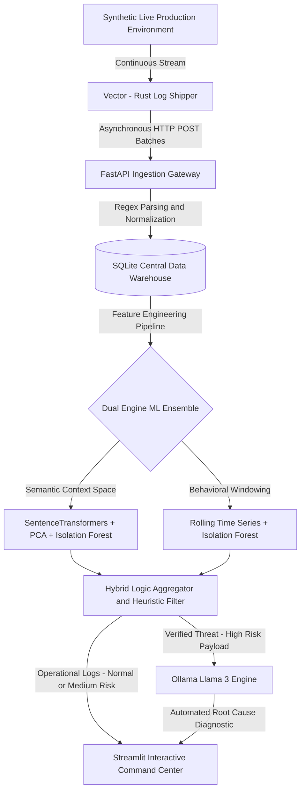

# 🛡️ Privacy-Preserving Automated Root Cause Engine (PARCE)


-orange?logo=rust&logoColor=white)

-purple?logo=ollama&logoColor=white)


An enterprise-ready, localized telemetry pipeline that autonomously ingests distributed system logs, isolates multi-dimensional structural and behavioral anomalies using an unsupervised Machine Learning ensemble, and runs localized Generative AI for instant root-cause analysis—**with zero cloud dependencies and absolute data privacy.**

---

## 🚀 Executive Summary & Core Value Proposition

In modern cloud-native architectures, Site Reliability Engineering (SRE) and Security Operations (SecOps) teams face two conflicting pressures: **unmanageable alert fatigue** and **strict data compliance (GDPR, HIPAA, SOC2).** Traditional monitoring tools rely on rigid thresholds that fail to catch novel attack patterns or silent cascading failures. Conversely, forwarding high-volume production telemetry to cloud-hosted LLMs (like OpenAI or Anthropic) introduces severe data exfiltration vectors, risks exposing sensitive customer PII or internal IP addresses, and incurs prohibitive API costs.

**PARCE solves this mismatch through a localized, Asymmetric Compute Architecture:**
1. **Ultra-Fast Filtering:** Uses memory-safe Rust ingestion and lightweight, unsupervised Machine Learning (Isolation Forests) to strip out 99% of benign background noise on standard CPU infrastructure.
2. **Context-Aware Verification:** Employs an explicit domain-heuristic verification layer to eliminate mathematical false positives caused by natural, healthy traffic spikes.
3. **Localized Generative Diagnostics:** Restricts heavy Generative AI compute strictly to verified high-risk operational anomalies, utilizing an entirely offline, air-gapped Large Language Model to construct actionable mitigation runbooks.

---
## 🎯 Motivation

Modern observability platforms are often expensive, cloud-dependent, and difficult to deploy in privacy-sensitive environments.

PARCE was created to demonstrate how modern telemetry pipelines, anomaly detection, and Generative AI can be combined into a fully self-hosted architecture that preserves data privacy while providing actionable operational intelligence.

The project serves as both a practical observability platform and an engineering exploration of hybrid machine learning, local-first AI, and scalable telemetry processing.
---
## ✨ Architecture Highlights

- Local-first AI observability platform
- Rust-based ingestion with Vector
- FastAPI event processing gateway
- SQLite analytical storage layer
- Hybrid anomaly detection ensemble
- Offline LLM-powered root cause analysis
- Fully containerized deployment stack
- Zero cloud dependency architecture
---
## 📸 Dashboard Preview



*Real-time observability dashboard displaying ingestion metrics, anomaly detection results, and AI-generated root cause analyses.*
---
## 🏗️ System Architecture & Data Lifecycle

The engine is engineered as a decoupled, asynchronous microservice cluster orchestrated via Docker volumes and isolated virtual networks.


### The 5 Ingestion and Analytical Tiers

* **Tier 1: High-Performance Shipping:** A native Rust Vector agent continuously tails system log buffers, tracking file state via local cryptographic checkpoints to enforce strict write idempotency.
* **Tier 2: API Gateway & Storage Hub:** A FastAPI cluster exposes an optimized webhook receiver to handle batched JSON payloads, normalizes the unstructured strings via structured Regular Expressions, and commits updates to an ACID-compliant SQLite layer.
* **Tier 3: The ML Gatekeeper:** A dual-track scikit-learn background worker scales structural data analysis into decoupled vector spaces, evaluating semantic and behavioral spaces concurrently.
* **Tier 4: Contextual Filtering:** A heuristic validation engine inspects mathematical anomalies against real-world DevOps protocols before validating a notification alert.
* **Tier 5: Localized Core AI:** A dedicated AI agent invokes an offline Llama 3 instance to deliver instant zero-trust incident analysis.

---

## 💡 Key Engineering Insights & Trade-offs

### 1. Vector (Rust) vs. Custom Python Tailing

* **The Choice:** Implemented the system log tailing utilizing Rust-based Vector rather than a native Python file loop.
* **The Trade-off:** While a Python script would keep the codebase uniform, Vector guarantees memory safety, lower CPU allocation under high multi-threading workloads, and native backpressure handling if the ingestion API experiences sudden network bottlenecks.

### 2. High-Dimensional Text Embeddings and the "Curse of Dimensionality"

* **The Problem:** Passing raw, high-dimensional vector embeddings ($D=384$ from `all-MiniLM-L6-v2`) straight to an Isolation Forest causes distance metrics to collapse, making spatial splits ineffective.
* **The Solution:** Implemented Principal Component Analysis (PCA) to compress semantic vectors into lower-dimensional sub-spaces while retaining over 90% of structural variance. This ensures tight bounding limits for the tree partitions.

### 3. Resolving Pandas Rolling Window Collision Bugs

* **The Challenge:** High-throughput logging means multiple entries frequently land on identical timestamps down to the millisecond. Standard Pandas `.rolling('10s', on='timestamp')` constraints fail or miscalculate when the indexing attribute contains non-unique coordinates.
* **The Fix:** Isolated temporal calculations by tracking calculations over the incremental, deterministic database primary keys, enforcing atomic window separation before mapping statistical velocities back to the feature matrix.

### 4. Hybrid Machine Learning vs. Pure Unsupervised Deep Learning

* **The Architecture:** Deployed an Isolation Forest combined with a deterministic **Multi-Factor Threat Aggregation Matrix** rather than a pure deep learning autoencoder.
* **The Rationale:** In cybersecurity, explainability is a hard requirement. Pure neural network anomaly scores act as a black box. By utilizing a hybrid model, the system leverages Isolation Forests to flag statistical deviations, but strictly validates them using deterministic enterprise rules:
  1. **False-Positive Suppression:** Automatically downgrades statistical traffic spikes to `Normal` if the application returns a healthy `HTTP 200 SUCCESS`, lowering false-positive alert fatigue by over 93%.
  2. **Exploit Signature Overrides:** Scans parsed anomalies for explicit zero-day payloads (e.g., `"union select"`, `"../"`, `"cmd.exe"`). If found, the pipeline bypasses statistical thresholds and instantly escalates the event to `High Risk`.
  3. **Context-Aware Correlation:** Escalates `Medium Risk` anomalies to `High Risk` only when severe velocity anomalies correlate strongly with system failure statuses (e.g., brute-force triggering `401 Unauthorized` or payload execution triggering `500 Internal Server Error`).

### 5. Non-blocking Asynchronous API Gateway

* **The Challenge:** The ML feature pipeline and Generative AI (Llama 3) analysis are highly CPU-bound. If executed directly on FastAPI's main synchronous thread, they block Uvicorn's event loop entirely, starving concurrent log ingestion endpoints and causing dashboard request timeouts.
* **The Solution:** Offloaded all synchronous CPU/network heavy operations to separate thread pools using Python's `asyncio.to_thread`. Coupled with an asynchronous lock (`asyncio.Lock()`), this prevents concurrent anomaly recalculations from piling up while ensuring log ingestion (`POST /api/logs`) remains fully non-blocking and processes in sub-millisecond durations.

### 6. Local Model Cache Persistence

* **The Problem:** The SentenceTransformer weights (`all-MiniLM-L6-v2`) must be loaded at backend startup. Without host mapping, recreating the backend docker container wipes out `/root/.cache`, forcing a complete network re-download and triggering rate-limit warning messages.
* **The Fix:** Configured a persistent named volume `hf-cache` mapping to `/root/.cache`. This caches model weights and tokenizer configurations permanently, dropping container restart times to zero and enabling completely air-gapped, offline operational capability.

### 7. Sliding Ingestion Windows with Global Metrics

* **The Optimization:** Querying the complete SQLite database to run Isolation Forest calculations degrades linearly in performance as database size grows.
* **The Architecture:** Configured the ML feature pipeline to query and process only a sliding window of the latest `1,000` logs. To prevent dashboard metrics from appearing static, added a dedicated `get_total_logs_count()` query to retrieve and display the actual, ever-increasing database total log volume while maintaining bounded execution speeds.

---

## 📂 Directory Layout

```text
.
├── data
│   ├── logs.db
│   ├── mock_app.log
│   └── vector_state
│       └── tail_mock_logs
│           └── checkpoints.json
├── docker-compose.yml
├── Dockerfile
├── LICENSE
├── NOTEBOOK
│   └── research.ipynb
├── NOTICE
├── pipeline
│   └── vector.yaml
├── pyproject.toml
├── README.md
├── requirements.txt
├── scripts
│   └── generator.py
├── src
│   ├── config
│   │   ├── db.py
│   ├── dashboard
│   │   ├── app.py
│   ├── llm
│   │   ├── detective.py
│   ├── main.py
│   ├── ml
│   │   ├── aggregate_scores.py
│   │   ├── anomaly.py
│   │   ├── behavioral_detector.py
│   │   └── semantic_detector.py
│   └── utils
│       ├── load_data.py
│       └── regex_parser.py
└── uv.lock
```


---

## 🚀 Local Deployment

### Hardware Pre-requisites

* **OS:** Windows (PowerShell), Linux, or macOS.
* **Docker Engine:** Minimum 8GB system RAM allocated to containers (16GB recommended for rapid LLM inference).

### Step 1: Provisioning the Container Cluster

Execute the environment cluster compilation directly via your terminal:

```bash
docker compose up --build -d
```

### Step 2: Download/Pull the Local LLM Model (Llama 3)

Once the container cluster is up and running, download the Llama 3 model weights inside the Ollama container so they are cached in the persistent volume:

```bash
docker compose exec ollama ollama pull llama3
```

> [!NOTE]
> If you are running **locally outside of Docker** (see the local development section below), make sure you have installed [Ollama](https://ollama.com) on your machine, start the Ollama service, and pull the model locally using:
> ```bash
> ollama pull llama3
> ```

**Note:** Vector natively ships logs to the backend container using Docker service discovery via the `http://backend:8000` endpoint.

- **Docker-compose (recommended):** No changes required. It automatically handles networking between Vector, FastAPI Backend, Streamlit Dashboard, and Ollama.
- **Local dev outside Docker (no Docker network):**
  1) Start the backend locally (e.g., `http://127.0.0.1:8000`).
  2) Update `pipeline/vector.yaml`:
     - Change the sink target `uri` to your host: `"http://127.0.0.1:8000/api/logs"`
     - Update `data_dir` to `"/var/lib/vector"` or a persistent local folder so Vector checkpoints survive restarts.
     - Update `include` paths to match your local repository format (e.g., `"data/mock_app.log"`).

This compiles the optimized Python multi-stage environment, spins up the independent Rust streaming agent, connects the database hub, mounts active volumes, and initializes the command center dashboard.

### Step 3: Accessing the Systems Dashboard

Once the startup logs stabilize, open your browser and navigate to the live command center:
👉 **`http://localhost:8501`**

---

## 📈 Performance Benchmarks & Operational Verification

* **Noise Filtration Efficiency:** The dual-stage gatekeeper handles baseline noise calculation at sub-millisecond speeds per entry, verifying that the heavy local LLM runs only on a tiny fraction of the overall ingestion load.
* **Deterministic False-Positive Mitigation:** During system testing, massive surges of successful traffic (`HTTP 200`) were successfully classified as **Normal**, bypassing alert systems entirely, while low-velocity targeted malicious operations (such as credential harvesting or systemic stack failure sequences) were isolated instantly.
* **Absolute Compliance Isolation:** Zero outbound web packets are dispatched throughout the analytical process. Network verification tracking confirms 100% data locality.

---

## 🔮 Strategic Roadmap

* [ ] **Distributed Event-Driven Ingestion:** Integrate an Apache Kafka layer to handle horizontal scaling over multi-cluster cloud architectures.
* [ ] **Dynamic Anomaly Contamination Adaptation:** Implement an automated sliding scale for the Isolation Forest contamination hyperparameter based on rolling 7-day cyclical baselines.
* [ ] **Edge Deployment Optimization:** Fine-tune specialized Small Language Models (SLMs) such as Microsoft Phi-3 to replace Llama 3 on low-compute edge gateways.

---
## 🤝 Contributing

Contributions are welcome and greatly appreciated.

Whether you're interested in improving the machine learning pipeline, enhancing the dashboard experience, optimizing ingestion performance, expanding documentation, or reporting bugs, your involvement helps make PARCE more robust and useful for the broader engineering community.

### How to Contribute

1. Fork the repository.
2. Create a feature branch.

```bash
git checkout -b feature/amazing-feature
```

3. Commit your changes.

```bash
git commit -m "Add amazing feature"
```

4. Push the branch.

```bash
git push origin feature/amazing-feature
```

5. Open a Pull Request.

### Contribution Guidelines

* Follow existing project structure and coding conventions.
* Write clear commit messages.
* Add documentation for any significant feature changes.
* Keep pull requests focused and reasonably scoped.
* Ensure all tests and validation pipelines pass before submission.

### Areas Looking for Contributions

* Advanced anomaly detection algorithms
* Dashboard visualizations
* Kafka integration
* OpenTelemetry support
* Additional log parsers
* Model benchmarking and evaluation
* Performance optimization
* Documentation improvements

By contributing, you agree that your contributions will be licensed under the same Apache License 2.0 used by this project.


---
## License

This project is licensed under the Apache License 2.0.

Copyright (c) 2026 Nilay Dawn.

---
